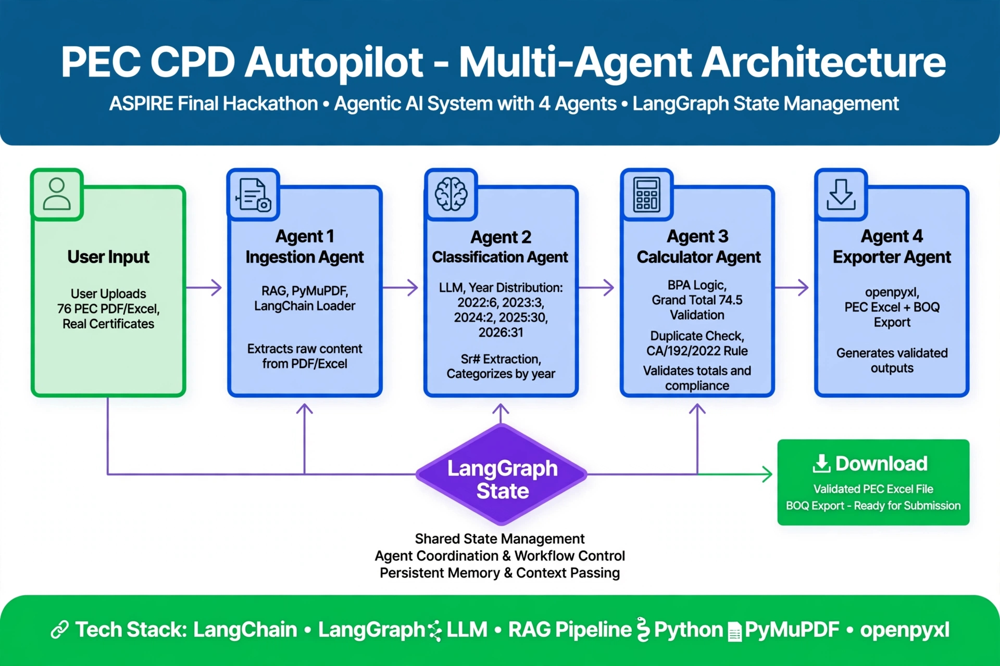

# PEC-CPD-Autopilot

**PEC CPD Autopilot - Agentic AI for 300k Pakistan Engineers**
**ASPIRE Final Hackathon - PEC CPD Points Calculator**

**Total 40 = 4 + 1 + 19 + 3 = 40**
- 2023: 4 Points
- 2024: 1 Point
- 2025: 19 Points
- 2026: 3 Points

**Live Demo:** https://pec-cpd-autopilot-rfr4wbq.streamlit.app/
**GitHub Repo:** https://github.com/qz59228/PEC-CPD-Autopilot

## Problem
Pakistan Engineers Council requires 40 CPD Points for License Renewal. Engineers manually calculate from 27 PDFs - takes hours, errors, duplicates.

## Solution
4-Agent LangGraph System auto-extracts, classifies, calculates, and exports PEC Excel + BOQ in seconds.

## Features
- Upload PEC CPD PDFs
- Agent 1 Ingestion - PyMuPDF, LangChain Loader, Extracts text from PDF/Excel
- Agent 2 Classification - LLM Year Distribution: 2023:4, 2024:1, 2025:19, 2026:3, Sr# Extraction, Categorizes by year
- Agent 3 Calculator - BPA Logic, Grand Total 40 Validation, Duplicate Check, CA/192/22 Rule, Validates totals and compliance
- Agent 4 Exporter - openpyxl, PEC Excel + BOQ Export, Generates validated outputs
- LangGraph State - Shared State Management, Agent Coordination & Workflow Control, Persistent Memory & Context Passing
- Download Validated PEC Excel File
- Download BOQ Export - Ready for Submission
- Duplicate Detection

## Architecture

## Tech Stack
LangChain, LangGraph, LLM, RAG Pipeline, Python, PyMuPDF, openpyxl, Streamlit

## How to Run
1. Clone repo
2. `pip install -r requirements.txt`
3. `streamlit run app.py`
4. Upload PDFs -> Get Total -> Download Excel

## Hackathon
ASPIRE Final Hackathon 2026
